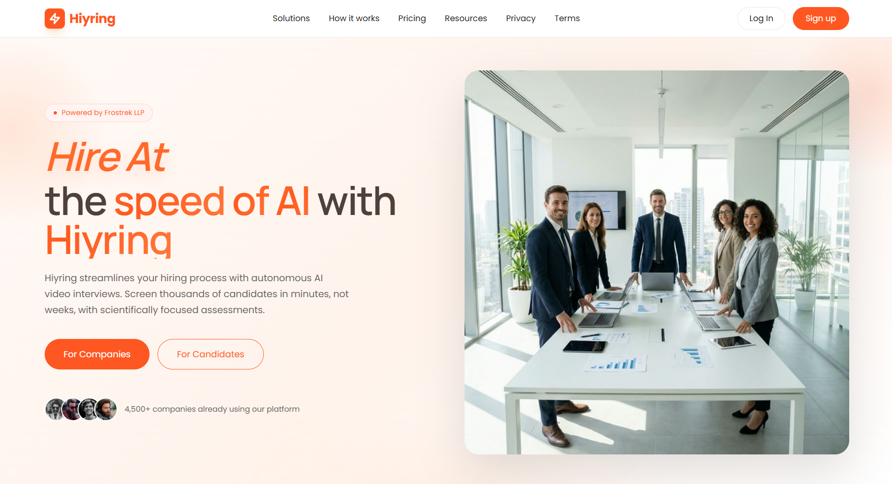
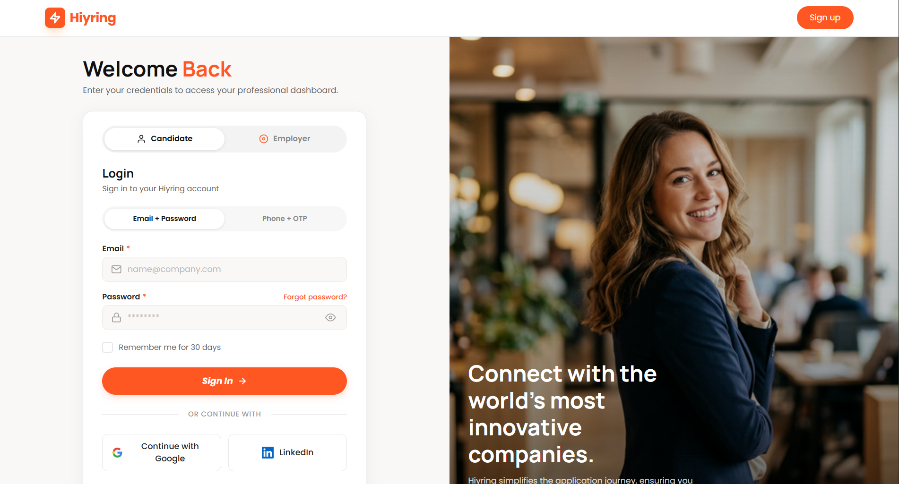
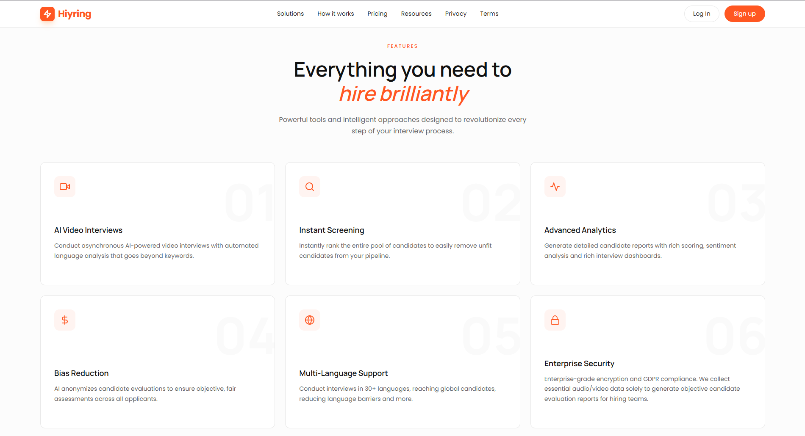
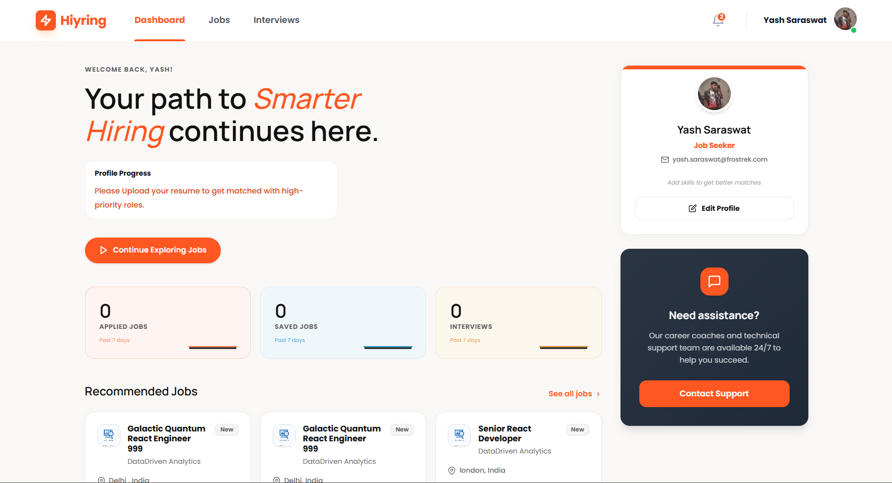
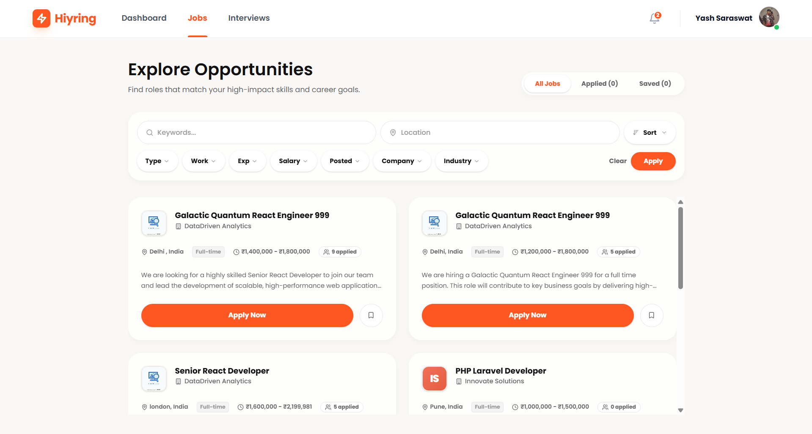

  
  
   
  
  <h1> Smart Job Hiring Platform</h1>
  
<b>Showcase Project: Hiyring - AI-Powered Video Interviews & Recruitment Workflow</b>

  
  

    <a href="#-project-overview">Overview</a> • 
    <a href="#-the-problem">The Problem</a> • 
    <a href="#-what-we-built">Core Features</a> • 
    <a href="#-live-product">Live Link</a> • 
    <a href="#-tech-stack">Tech Stack</a>
  

---

##  Project Overview

**Hiyring** is a full-stack AI hiring platform engineered end-to-end by Frostrek. It is designed to help recruitment teams screen candidates exponentially faster using intelligent video interviews, structured evaluations, and highly scalable workflows. 

---

##  The Problem We Solved

Growing organizations struggle to maintain quality while scaling their hiring efforts. We built this platform to resolve three critical bottlenecks:

1. **Wasted Recruiter Hours:** Teams spend hundreds of hours on repetitive first-round screening calls that simply don't scale.
2. **Inconsistent Evaluations:** Unstructured human interviews often lead to biased and inconsistent hiring decisions across different interviewers.
3. **Lack of Scalable Workflow:** Rapidly growing teams need infrastructure that can handle large candidate volumes across different time zones without requiring additional headcount.

---

##  What We Built (Core Features)

We built an intelligent, automated layer between application and final interview, ensuring only the most qualified candidates reach human recruiters.

###  AI Video Interviews
Candidates record responses to structured, asynchronous video questions. The built-in AI engine evaluates tone, clarity, and content contextually.

###  Structured Evaluation Engine
Standardized scoring rubrics ensure every single candidate is assessed objectively and on the exact same criteria, eliminating subjective scoring.

###  Bias Reduction
The AI engine actively anonymizes candidate evaluations to ensure fair, objective assessments across the entire applicant pool regardless of background.

###  Recruiter Dashboard
A centralized command center to manage active roles, review candidate video submissions, compare AI scores, and move shortlists forward seamlessly.

###  Scalable Hiring Pipelines
An infrastructure robust enough to support anywhere from 10 to 10,000+ candidates simultaneously, handling massive applicant volume without degrading performance.

---

##  Product Gallery

Explore the Hiyring AI Platform interface and candidate workflows:

  
  
  
  

---

##  Live Product

Check out the live product built by Frostrek:  
 **[hiyring.com](https://hiyring.com)**

---

##  Tech Stack & Infrastructure

The Hiyring platform relies on a modern, AI-integrated stack to ensure fast video processing and reliable AI evaluations:

---

  <h3>Looking to automate your enterprise workflows?</h3>
  
Reach out to the <b>Frostrek AI</b> team to integrate AI into your business operations.

  <a href="https://www.frostrek.ai/contact"><b>Contact Us Today</b></a>

